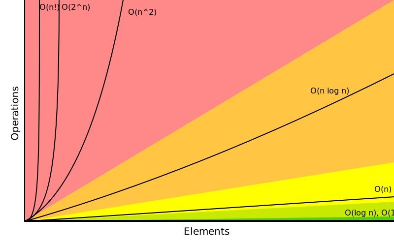

# Big-O Notation

The time and space complexity of each data structure and algorithm is given in terms of Big-O notation. The following table lists the common Big-O functions in increasing order of growth rate.

| Big-O      | Name        | Description                                                                                                                                      |
| ---------- | ----------- | ------------------------------------------------------------------------------------------------------------------------------------------------ |
| O(1)       | Constant    | The algorithm's time or space requirements remain constant regardless of the size of the input. No loops, a statement, one line of code          |
| O(log n)   | Logarithmic | The algorithm's time or space requirements grow logarithmically with respect to the size of the input. Usually search algorithms (Binary Search) |
| O(n)       | Linear      | The algorithm's time or space requirements grow linearly with respect to the size of the input. Loops such as for loops or while loops           |
| O(n log n) | Log-linear  | The algorithm's time or space requirements grow log-linearly with respect to the size of the input. Usually sorting operations                   |
| O(n^2)     | Quadratic   | The algorithm's time or space requirements grow quadratically with respect to the size of the input. Two nested loops                            |
| O(n^3)     | Cubic       | The algorithm's time or space requirements grow cubically with respect to the size of the input. Three nested loops                              |
| O(2^n)     | Exponential | The algorithm's time or space requirements grow exponentially with respect to the size of the input. Complex full search, recursive algorithms   |
| O(n!)      | Factorial   | The algorithm's time or space requirements grow factorially with respect to the size of the input. Factorial algorithms                          |



[Source](https://www.bigocheatsheet.com/)

## Example

```python
NEMO = ['nemo']
EVERYONE = ['dory', 'bruce', 'marlin', 'nemo', 'gill', 'bloat', 'nigel', 'squirt', 'darla', 'hank']
LARGE = ['nemo' for i in range(10000)]

def find_nemo(array):
    t0 = time.time()
    for i in range(len(array)):
        if array[i] == 'nemo':
            print('Found NEMO!')
    t1 = time.time()
    print(f'Call to find Nemo took {(t1 - t0)} milliseconds')

find_nemo(EVERYONE)
```

```python
def funChallenge(input):
    a = 10 # O(1)
    a = 50 + 3 # O(1)

    for i in input: # O(n)
        anotherFunction() # O(n)
        stranger = True # O(n)
        a += 1 # O(n)
    return a # O(1)
```

The Big-O notation for this function is O(3 + 4n) or O(n).

```python
def anotherFunChallenge(input):
    a = 5 # O(1)
    b = 10 # O(1)
    c = 50 # O(1)
    for i in input:
        x = i + 1 # O(n)
        y = i + 2 # O(n)
        z = i + 3 # O(n)
    for j in input:
        p = j * 2 # O(n)
        q = j * 2 # O(n)
    who_am_i = "I don't know" # O(1)
```

The Big-O notation for this function is O(4 + 5n) or O(n).

## Rules

1. **Worst Case**: The Big-O notation describes the _worst_ case scenario for the algorithm. For example, the time complexity of the `find_nemo` function is O(n) because the `for` loop could have to iterate through the entire array to find `nemo`.
2. **Remove Constants**: The Big-O notation ignores constants.
3. **Different terms for inputs**:

   - Different inputs should have different variables: **_O(a + b)_** (+ for steps in order).
   - A and B arrays nested would be **_O(a \* b)_** (\* for nested steps).

4. **Drop Non-Dominant Terms**: The Big-O notation ignores non-dominant terms. If the time complexity is O(n + n^2), the Big-O notation is O(n^2) - the dominant term.
